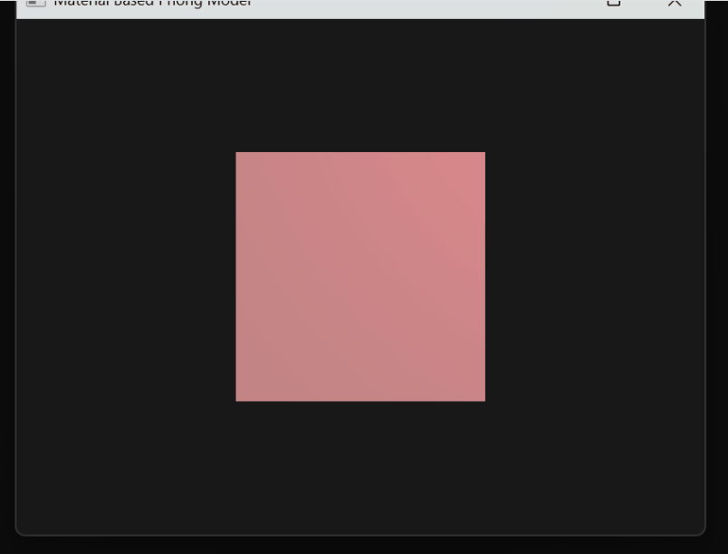
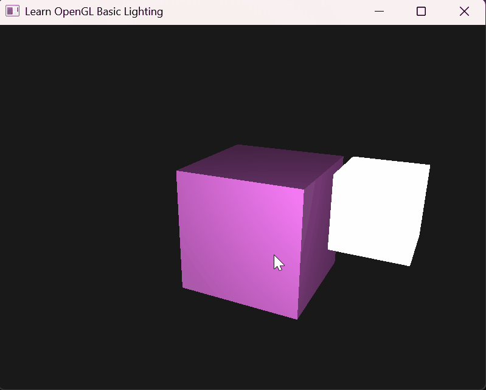
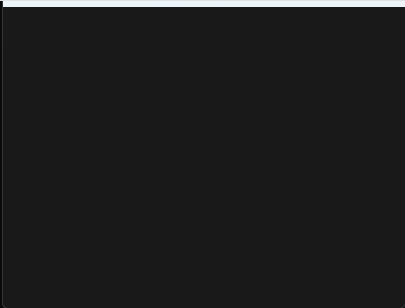
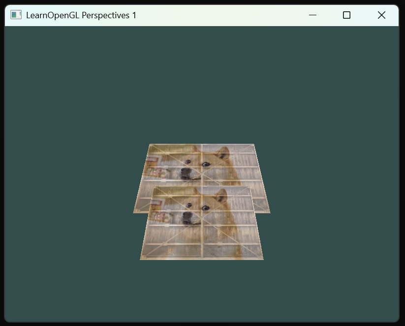
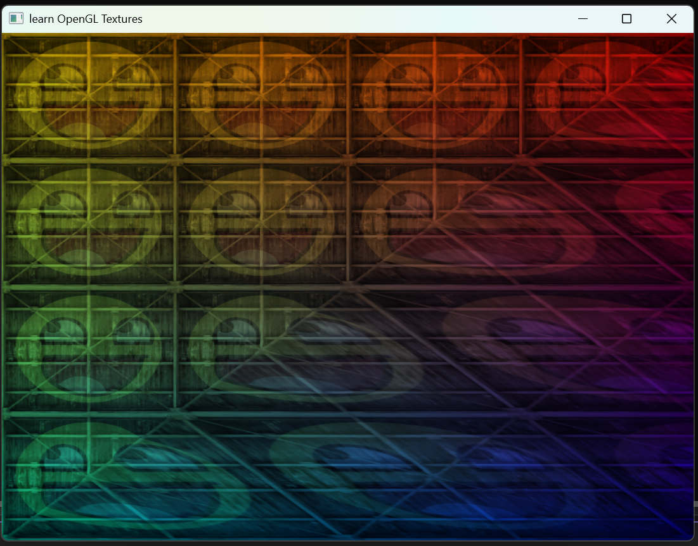
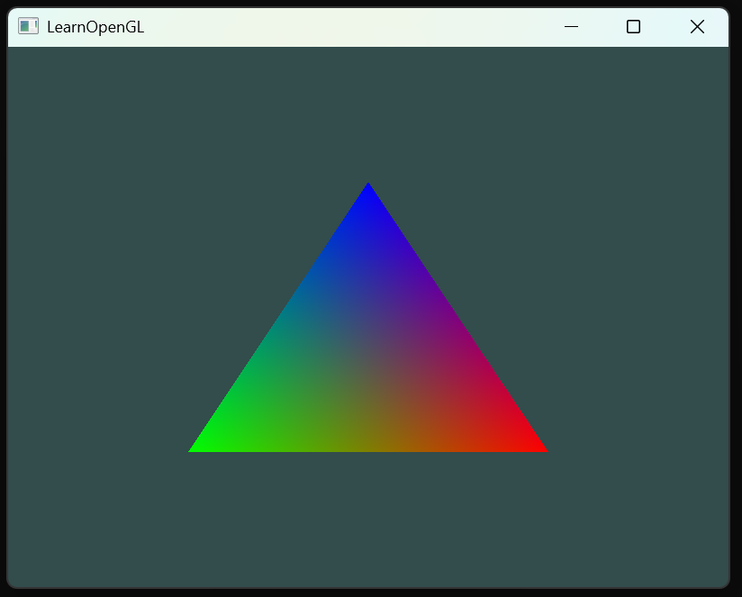
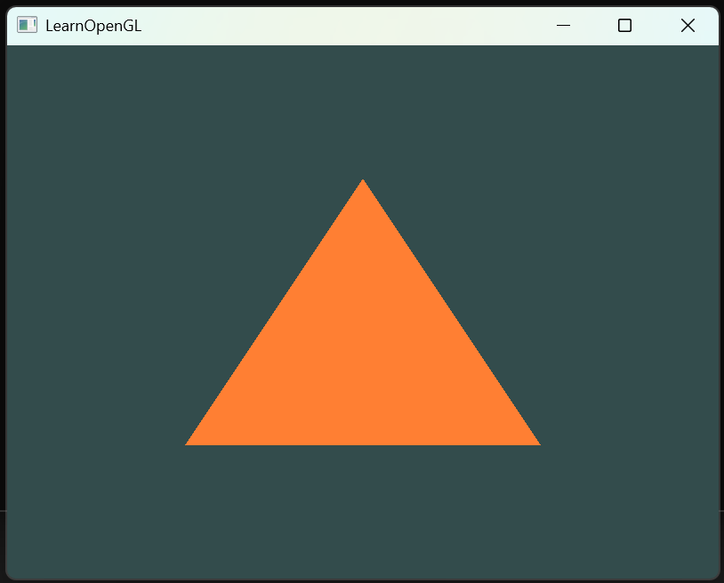

# LearnOpenGL

A comprehensive learning repository for OpenGL graphics programming in C++, following modern OpenGL practices (OpenGL 3.3+). This project contains implementations of various OpenGL concepts, from basic window creation to advanced rendering techniques.

## Overview

This repository simply documents my hands-on learning journey and exercises covering fundamental OpenGL topics. Each example is self-contained and demonstrates specific OpenGL concepts with detailed comments and notes. Most of the code for now are direclty associated with units from learnopengl.com.

## Table of Contents

- [Screenshots](#screenshots)
- [Prerequisites](#prerequisites)
- [Building the Project](#building-the-project)
- [Learning Resources](#learning-resources)
- [License](#license)

## Renders
### Advanced OpenGL
#### Object Outlining
<i>(03-18-2026)</i>


### Lighting
#### Multiple Lights
<i>(03-08-2026)</i>


#### Flashlight 
<i>(03-07-2026)</i>


#### Interesting Game Effect (Flashlight with hardedges)
<i>(03-07-2026)</i>


#### Point Light
<i>(03-05-2026)</i>


#### Phong Lighting Maps Material Model
<i>(03-04-2026)</i>


#### Phong Material Based Model
<i>(03-03-2026)</i>


#### Phong Model Basic Setup
<i>(02-27-2026)</i>


#### Basic Light Source and Color Render
<i>(02-25-2026)</i>


### Camera
#### Free 3D Space Navigation with Doge Cubes
<i>(02-22-2026)</i>


#### Basic camera revolutions
<i>(02-19-2026)</i>


### Coordinate System
#### Basic Perspective Transform 3D Multiple
<i>(02-18-2026)</i>


#### Basic Perspective Transform 3D
<i>(02-18-2026)</i>


#### Basic Perspective Transform
<i>(02-18-2026)</i>


### Transformations 
<i>(02-17-2026)</i>


### Texture Rendering
<i>(02-16-2026)</i>


### VBO and EBO Visualization
<i>(02-09-2026)</i>


### First Render
<i>(02-01-2026)</i>



## Prerequisites

### Required Dependencies

- **C++ Compiler**: MSVC 2019 or later (Visual Studio)
- **OpenGL**: Version 3.3 or higher
- **GLFW**: Window creation and input handling
- **GLAD**: OpenGL function loader
- **GLM**: OpenGL Mathematics library (for transformations)
- **stb_image**: Image loading library (included in project)

### Operating System

- Windows (Visual Studio project)
- Can be adapted for Linux/macOS with CMake

## Building the Project

### Using Visual Studio

1. **Clone the repository**:
   ```bash
   git clone https://github.com/yourusername/learnOpenGL.git
   cd learnOpenGL
   ```

2. **Open the solution**:
   - Open `learnOpenGL.slnx` in Visual Studio 2022 or later

3. **Configure the project**:
   - Ensure GLFW and GLM are properly linked
   - Set include directories for GLAD, GLFW, GLM, and stb_image
   - Set library directories for GLFW

4. **Build**:
   - Select your build configuration (Debug/Release)
   - Build the solution (Ctrl+Shift+B)

5. **Run**:
   - Set the desired .cpp file as the startup file
   - Run the project (F5 or Ctrl+F5)

### Dependencies Setup

Make sure to link the following libraries in your project settings:

- `opengl32.lib`
- `glfw3.lib` (or `glfw3dll.lib` if using DLL)

Include directories should point to:
- GLAD include folder containing `glad/glad.h`
- GLFW include folder containing `GLFW/glfw3.h`
- GLM include folder containing `glm/glm.hpp`

## Learning Resources

This project follows the excellent tutorials from:

- **[LearnOpenGL.com](https://learnopengl.com/)** - Primary learning resource
- **[OpenGL Documentation](https://www.opengl.org/documentation/)** - Official reference
- **[GLFW Documentation](https://www.glfw.org/documentation.html)** - Window management
- **[GLM Documentation](https://github.com/g-truc/glm)** - Mathematics library


## License

This project is licensed under the MIT License - see the [LICENSE](LICENSE) file for details.

Copyright (c) 2026 Bill Wang

## Acknowledgments

- Joey de Vries for the amazing [LearnOpenGL](https://learnopengl.com/) tutorials
- The OpenGL community for extensive documentation and support
- GLFW, GLAD, GLM, and stb_image library authors

---
